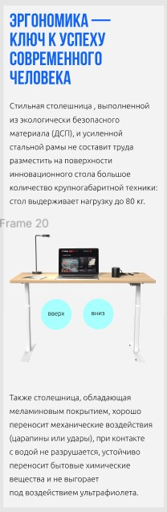
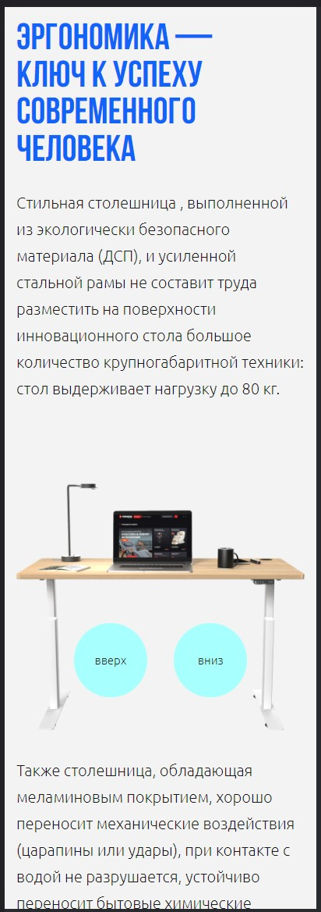
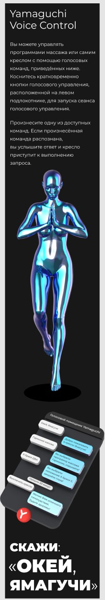
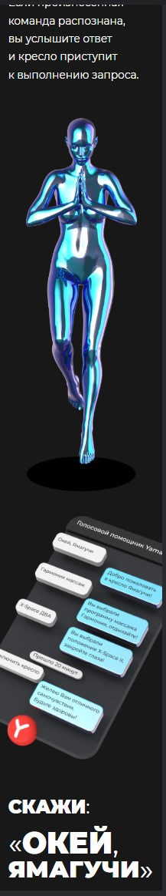

Тест для компании Yamaguchi
===

#### Верстка по макету. HTML, CSS, JS.
#Также использовались SCSS, GULP, StyleLint. Для удобства и практики.

## Задача сверстать и анимировать. Кнопки должны работать.
#Макет(в Figma) был сделан с большими картинками, не дающими считать размеры точно. Делал на глаз. 

## Решение задачи. Сначала пример, потом результат

## Mobile 320x***. .gif здесь не записывал
