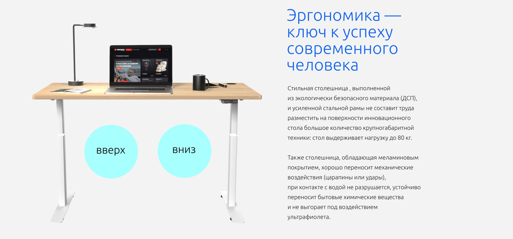
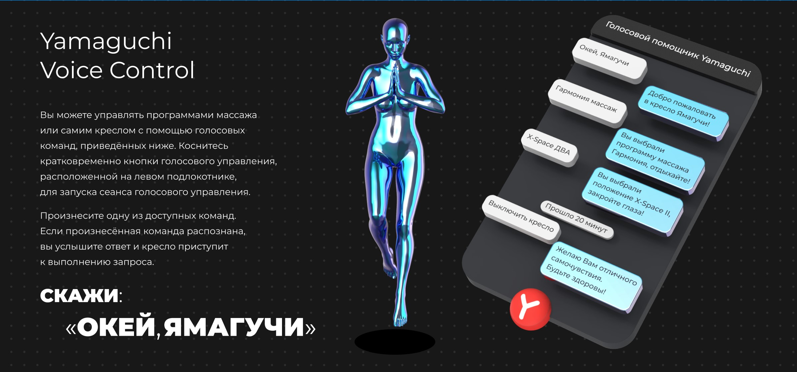
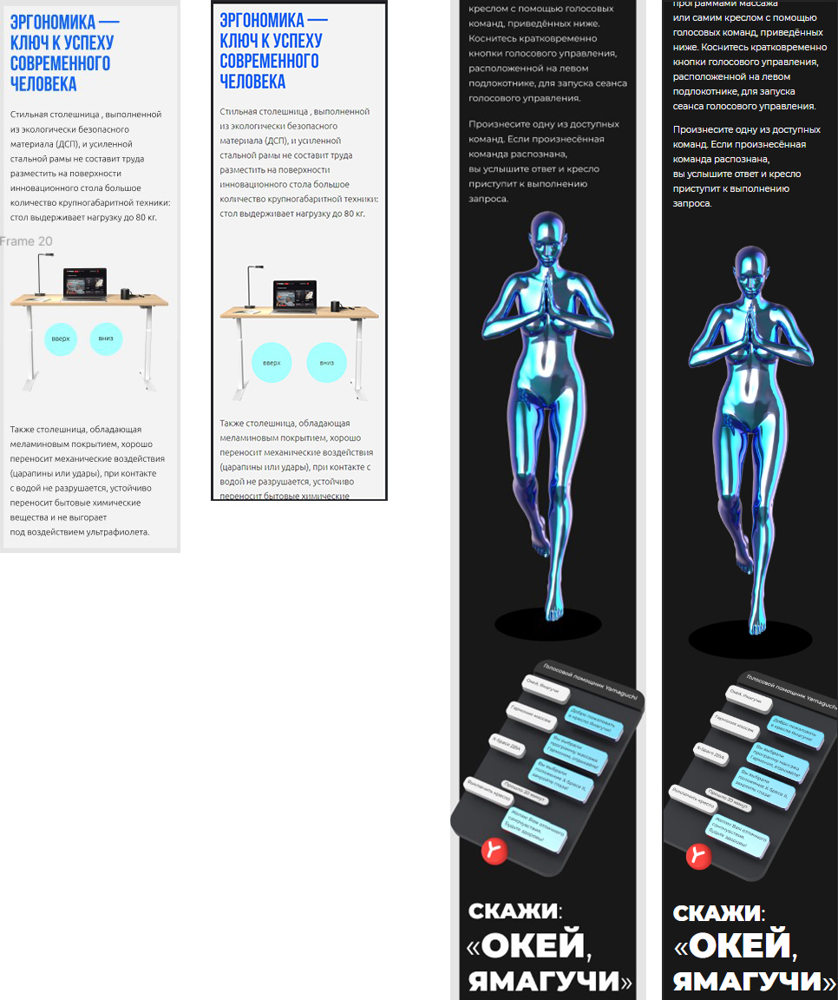

Тест для компании Yamaguchi
===

# Верстка по макету. HTML, CSS, JS.
#### Также использовались SCSS, GULP, StyleLint. Для удобства и практики.

## Задача сверстать и анимировать. Кнопки должны работать.
#### Макет(в Figma) был сделан с большими картинками, не дающими считать размеры точно.
#### Доступен только для чтения. Поэтому делал на глаз. 

## Решение задачи. Сначала пример, потом результат

## Mobile версии. 
#### Помимо нечитаемых размеров картинок, внутри блоков текста использованы разные шрифты и их размеры.
#### Без прав доступа я не мог их считать и подбирал по тем, что имеются. Не давайте, пожалуйста, такие макеты =(

